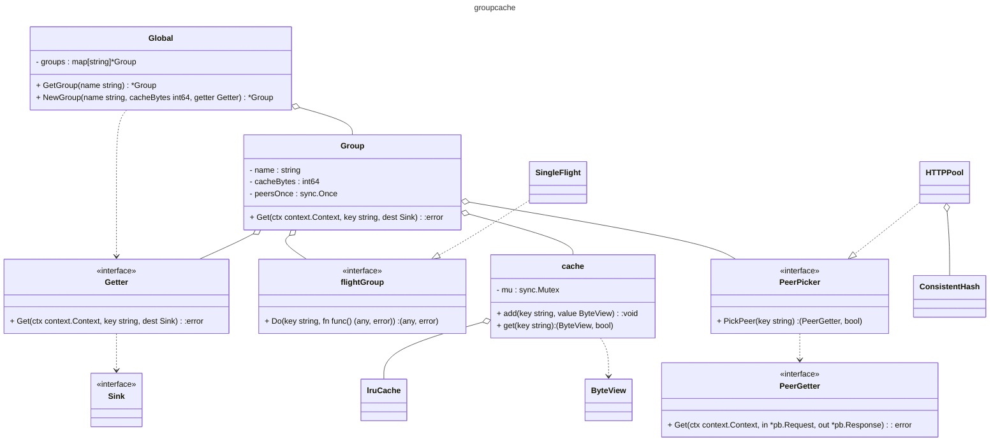

# groupcache

## Summary

groupcache is a distributed caching and cache-filling library, intended as a
replacement for a pool of memcached nodes in many cases.

For API docs and examples, see http://godoc.org/github.com/adrian-lin-1-0-0/groupcache

## Class Diagram

## Technical Concepts
- LRU Cache
- Consistent Hash
- SingleFlight
- http.RoundTripper
- gRPC

## Comparison to memcached

### **Like memcached**, groupcache:

 * shards by key to select which peer is responsible for that key

### **Unlike memcached**, groupcache:

 * does not require running a separate set of servers, thus massively
   reducing deployment/configuration pain.  groupcache is a client
   library as well as a server.  It connects to its own peers, forming
   a distributed cache.

 * comes with a cache filling mechanism.  Whereas memcached just says
   "Sorry, cache miss", often resulting in a thundering herd of
   database (or whatever) loads from an unbounded number of clients
   (which has resulted in several fun outages), groupcache coordinates
   cache fills such that only one load in one process of an entire
   replicated set of processes populates the cache, then multiplexes
   the loaded value to all callers.

 * does not support versioned values.  If key "foo" is value "bar",
   key "foo" must always be "bar".  There are neither cache expiration
   times, nor explicit cache evictions.  Thus there is also no CAS,
   nor Increment/Decrement.  This also means that groupcache....

 * ... supports automatic mirroring of super-hot items to multiple
   processes.  This prevents memcached hot spotting where a machine's
   CPU and/or NIC are overloaded by very popular keys/values.

 * is currently only available for Go.  It's very unlikely that I
   (bradfitz@) will port the code to any other language.

## Loading process

In a nutshell, a groupcache lookup of **Get("foo")** looks like:

(On machine #5 of a set of N machines running the same code)

 1. Is the value of "foo" in local memory because it's super hot?  If so, use it.

 2. Is the value of "foo" in local memory because peer #5 (the current
    peer) is the owner of it?  If so, use it.

 3. Amongst all the peers in my set of N, am I the owner of the key
    "foo"?  (e.g. does it consistent hash to 5?)  If so, load it.  If
    other callers come in, via the same process or via RPC requests
    from peers, they block waiting for the load to finish and get the
    same answer.  If not, RPC to the peer that's the owner and get
    the answer.  If the RPC fails, just load it locally (still with
    local dup suppression).

## Users

groupcache is in production use by dl.google.com (its original user),
parts of Blogger, parts of Google Code, parts of Google Fiber, parts
of Google production monitoring systems, etc.

## Presentations

See http://talks.golang.org/2013/oscon-dl.slide

## Help

Use the golang-nuts mailing list for any discussion or questions.
